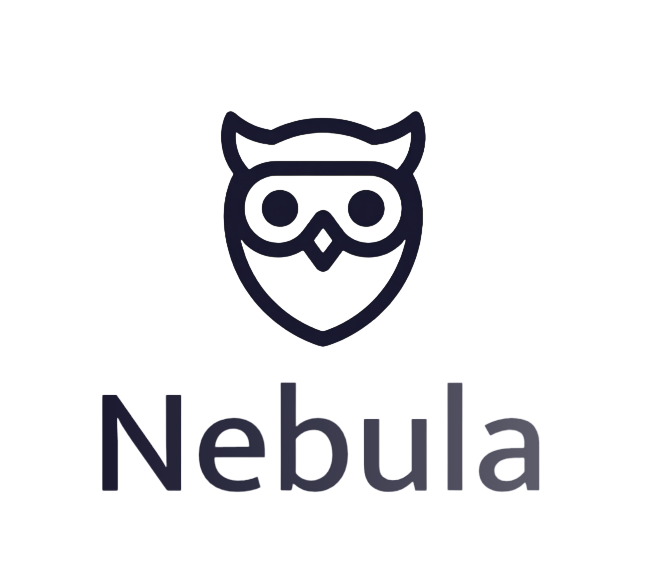

# Nebula 🌌

**Nebula** is a modern, fast, and keyboard-centric mind mapping application built with Electron. It combines the speed of text-based entry with the visual power of mind maps, designed for users who want to capture ideas instantly without friction.



## ✨ Key Features

### 🚀 **Speed & Efficiency**
- **Raycast-like Quick Entry**: Press `Ctrl + Space` (or `Cmd + Space` on Mac) anywhere on your computer to open a floating input bar. Capture ideas without switching windows.
- **Slash Commands**: Use powerful commands directly in the Quick Entry bar:
  - `/quick <text>`: Instantly saves a note to a new file in the background.
  - `/create <topic>`: Opens the full app with a brand new mind map starting with your topic.
- **Keyboard First**: Create, edit, and navigate your mind map entirely using keyboard shortcuts.

### 🎨 **Modern Design**
- **Frameless UI**: A sleek, distraction-free interface that maximizes your canvas space.
- **Glassmorphism**: Beautiful, translucent UI elements that feel native and modern.
- **Dark Mode**: Deep space-themed dark mode for late-night brainstorming sessions.

### 🛠 **Power User Tools**
- **System Tray Integration**: Nebula runs quietly in the background. Close the window to minimize to the tray, keeping it ready for instant access.
- **PDF Export**: Export your mind maps to high-quality PDF documents for sharing.
- **Local Files**: Your data stays on your machine. Save and load `.neb` files securely.

---

## ⌨️ Shortcuts

| Action | Shortcut |
|--------|----------|
| **Global Quick Entry** | `Ctrl + Space` |
| **Add Child Node** | `A` or `N` |
| **Delete Node** | `Del` or `Backspace` |
| **Edit Node** | Double Click |
| **Save Map** | `Ctrl + S` |
| **Center View** | `Ctrl + C` |
| **Zoom In/Out** | `Ctrl + Scroll` |
| **Pan Canvas** | `Click + Drag` |
| **Cancel / Deselect** | `Esc` |

---

## 🚀 Getting Started

### Prerequisites
- [Node.js](https://nodejs.org/) (v16 or higher)
- npm (comes with Node.js)

### Installation

1. **Clone the repository**
   ```bash
   git clone https://github.com/yourusername/nebula.git
   cd nebula
   ```

2. **Install dependencies**
   ```bash
   npm install
   ```

3. **Run the app**
   ```bash
   npm start
   ```

---

## 🏗 Tech Stack

- **Framework**: [Electron](https://www.electronjs.org/)
- **Frontend**: Vanilla JavaScript, HTML5, CSS3 (Modern Variables & Flexbox)
- **Icons**: [Lucide](https://lucide.dev/)
- **PDF Generation**: `jspdf` & `html2canvas`

---

## 📝 License

This project is licensed under the MIT License - see the [LICENSE](LICENSE) file for details.
